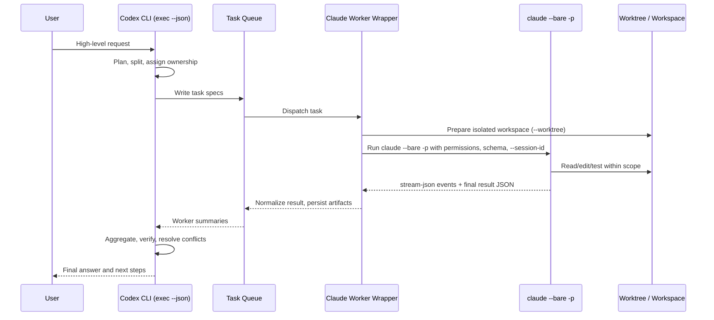
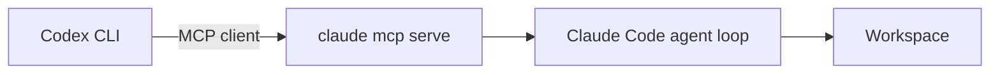

# Codex → Claude Code Worker Architecture (Proposal)

> This is a design proposal, not external research. Sourced primarily from `../references/`. Subject to change as the system evolves.

This document proposes a system in which a Codex CLI orchestrator dispatches
discrete units of work to one or more Claude Code CLI workers and aggregates
the results.

## Goals

- Codex interprets the user's request and decomposes it into discrete tasks.
- Claude Code CLI executes clearly scoped units of work in isolation.
- Every worker invocation has a reproducible input, permission, and output
  contract.
- Codex re-reviews each result and decides on conflicts, test status, and
  requirements coverage before reporting back to the user.

## Non-goals

- Claude Code is not used as an unrestricted general-purpose shell agent.
- Two or more workers are not allowed to edit the same file concurrently.
- External issues, web pages, and documentation are not treated as trusted
  instructions.
- No worker pushes directly to a protected branch.
- Neither Claude nor Codex global settings are modified automatically.

## Baseline architecture: subprocess worker pool

The initial implementation places a wrapper around `claude` (specifically the
`claude --bare -p` headless mode — see
[Claude Code Reference §3.2](../references/02-claude-code-cli.md#32-headless-p-print-mode))
that Codex spawns per task. `--bare` is the recommended mode for scripted /
SDK calls and is documented as the future default of `-p`
([Claude Code Reference §10.3](../references/02-claude-code-cli.md#103-authentication-for-headless-ci)).



### Components

| Component | Responsibility |
| --- | --- |
| Codex planner | Decomposes the user request into work units, assigns priority and dependencies. Driven by `codex exec --json` ([Codex Reference §3.2](../references/01-codex-cli.md#32-non-interactive-exec-mode)). |
| Task queue | Stores task specs, status, retry count, and worker results. A file-based JSONL log is sufficient for the initial cut. |
| Worker wrapper | Builds the `claude --bare -p` argv, applies permission flags, enforces timeouts, collects logs, parses the result, and validates against the JSON schema. |
| Workspace manager | Creates per-task git worktrees or scratch copies. Can use Claude's `--worktree <name>` flag which checks out into `<repo>/.claude/worktrees/<name>` ([Claude Code Reference §10.2](../references/02-claude-code-cli.md#102-identity-isolation-concurrency)). |
| Result aggregator | Merges worker outputs and identifies conflicts, overlapping changes, and missing tests. |
| Verifier | Runs tests, linters, static analysis, and review hooks. |

## Task decomposition criteria

A unit of work is dispatched to a Claude worker only when **all** of the
following hold:

- File ownership for the change is unambiguous.
- Completion can be checked from the worker's JSON result.
- The required permission surface is narrow.
- The task is independent, or its dependencies are explicit.
- The task can be retried or discarded if it fails without corrupting prior
  work.

A task is **not** dispatched when:

- Requirements are ambiguous and a user decision is needed first.
- More than one worker would write the same file in parallel.
- The work involves secrets, deployment, account configuration, or
  infrastructure destruction.
- The task requires executing instructions found in external documents.

## Task state model

The initial file-based queue is adequate with just the following states:

```text
planned -> ready -> running -> succeeded
                         \-> failed
                         \-> needs-review
                         \-> blocked
```

State definitions:

- `planned` — identified by Codex but execution order not yet fixed.
- `ready` — can be picked up by a wrapper.
- `running` — wrapper has launched `claude --bare -p` and is consuming its
  output stream.
- `succeeded` — schema validation passes and the minimum verification
  commands (tests, lint) succeed. For Claude this means
  `result.subtype === "success"`
  ([Claude Code Reference §4](../references/02-claude-code-cli.md#4-output-formats)).
- `failed` — process exit code is non-zero, the result schema fails, or
  verification commands fail. For Claude this corresponds to any
  `result.subtype` other than `"success"` — notably
  `error_max_turns`, `error_during_execution`, `error_max_budget_usd`, and
  `error_max_structured_output_retries` (the last specifically signals
  `--json-schema` could not be satisfied).
- `needs-review` — changes were produced but conflicts, risk, or ambiguity
  remain.
- `blocked` — cannot proceed without external input such as a secret, a
  permission grant, or a user decision.

## Task spec example

```json
{
  "task_id": "T-0007",
  "title": "Add unit tests for parser edge cases",
  "kind": "test",
  "role": "implementer",
  "workspace": ".claude/worktrees/T-0007",
  "session_id": "550e8400-e29b-41d4-a716-446655440007",
  "allowed_paths": [
    "src/parser/",
    "tests/parser/"
  ],
  "forbidden_paths": [
    ".env",
    ".env.*",
    ".git/",
    ".claude/",
    ".codex/"
  ],
  "permission_mode": "acceptEdits",
  "allowed_tools": [
    "Read",
    "Glob",
    "Grep",
    "Edit",
    "Write",
    "Bash(npm test *)"
  ],
  "disallowed_tools": [
    "Bash(git push *)",
    "Bash(git reset *)",
    "Bash(rm *)"
  ],
  "max_turns": 20,
  "max_budget_usd": 2.0,
  "definition_of_done": [
    "Tests cover empty input, malformed token, and unicode identifier cases.",
    "Existing parser behavior is unchanged.",
    "npm test -- parser-edge-cases exits 0."
  ],
  "verification_commands": [
    "npm test -- parser-edge-cases"
  ],
  "expected_output_schema": "schemas/worker-result.schema.json"
}
```

Notes:

- `session_id` is minted by Codex so it can correlate logs and, if needed,
  resume the same conversation later via `--resume <id>` or
  `--session-id <UUID>` ([Claude Code Reference §3.3](../references/02-claude-code-cli.md#33-session-resume-resume-continue)).
- `max_budget_usd` is enforced by `--max-budget-usd N` and surfaces as
  `result.subtype === "error_max_budget_usd"` on overrun.

## Worker result example

```json
{
  "task_id": "T-0007",
  "session_id": "550e8400-e29b-41d4-a716-446655440007",
  "status": "succeeded",
  "summary": "Added parser edge case tests for empty input and malformed tokens.",
  "changed_files": [
    "tests/parser/parser-edge-cases.test.ts"
  ],
  "commands_run": [
    {
      "command": "npm test -- parser-edge-cases",
      "exit_code": 0
    }
  ],
  "risks": [],
  "needs_human_review": false,
  "notes_for_codex": "No production code changed."
}
```

The wrapper produces this object by extracting `result.result` (or
`result.structured_output` when `--json-schema` was used) and combining it
with locally observed signals (diff, exit codes of verification commands,
`total_cost_usd` from the final `result` event).

## Parallelism policy

The initial defaults are deliberately conservative:

- Read-only investigation tasks may run in parallel.
- Write tasks may run in parallel only when their `allowed_paths` are
  disjoint.
- If one worker fails, all dependent tasks move to `blocked` until Codex
  re-plans.
- Tests or builds in the same package that share global state (port,
  database, generated cache) are serialized.
- Dependency installation, DB migration, code generation, and lockfile
  changes are always performed by a single worker.
- A fan-out beyond ~5 concurrent workers requires explicit operator opt-in.
  Neither Codex `exec` nor Claude documents a backpressure signal for
  parallel CLI invocations; only Codex `app-server` exposes JSON-RPC
  error `-32001` ("Server overloaded; retry later") for in-band
  backpressure ([Codex Reference §9.1](../references/01-codex-cli.md#91-useful-capabilities)).
  Above the soft cap the wrapper must rate-limit itself.

## MCP bridge — alternative architecture

Both CLIs expose MCP server modes:

- Claude Code: `claude mcp serve` makes Claude Code itself an MCP server
  ([Claude Code Reference §9.2](../references/02-claude-code-cli.md#92-as-mcp-server)).
- Codex: `codex mcp-server` runs Codex itself as an MCP server over stdio
  ([Codex Reference §8.2](../references/01-codex-cli.md#82-codex-as-mcp-server-codex-mcp-server)).

Either side can act as the host. The most natural orchestration shape for
this project is **Codex as MCP client, Claude as MCP server**:



Validation checklist before adopting this path:

- Confirm `codex mcp add claude-code -- claude mcp serve` registers cleanly
  in the current environment.
- Use Codex's TUI `/mcp` slash command or an MCP inspector to enumerate the
  exposed tool surface — the Claude docs describe the *installation*, not
  the tool contract ([Claude Code Reference §9.2](../references/02-claude-code-cli.md#92-as-mcp-server)).
- Invoke a single read-only task and record the input/output shape.
- Verify timeout, concurrent invocation, session persistence, and retry
  behavior on error.
- Promote this path to the baseline only when its result shape is at least
  as stable as the subprocess wrapper's.

A symmetric inverse — **Claude as MCP client, Codex as MCP server** via
`codex mcp-server` — is also possible if a different ownership model is
desired; the current project assumes Codex is the orchestrator.

## Long-term extensions

Future work, beyond the initial wrapper:

- SQLite-backed task queue with a structured event log.
- Automatic per-task git worktree creation and cleanup (Claude's
  `--worktree <name>` provides the per-worker checkout primitive).
- Tighter JSON Schema enforcement via Claude's `--json-schema` and Codex's
  `--output-schema`. Treat
  `result.subtype === "error_max_structured_output_retries"` as the canonical
  schema-failure signal for Claude.
- Cost, token, and time budget aggregation across worker fleet
  (`total_cost_usd` from each Claude `result`,
  `turn.completed.usage` from each Codex run).
- Failure-cause classification and bounded auto-retry.
- A review report linking diff to test results and verification logs.
- Long-running daemon-style integration via Codex `app-server`
  (JSON-RPC 2.0 over stdio, WebSocket, or Unix socket; WebSocket auth uses
  `--ws-auth signed-bearer-token` with a shared secret file
  — see [Codex Reference §9.1](../references/01-codex-cli.md#91-useful-capabilities))
  or the Claude Agent SDK for in-process worker management.

## References

- [Codex CLI Reference §3.2 — Non-interactive exec mode](../references/01-codex-cli.md#32-non-interactive-exec-mode)
- [Codex CLI Reference §4 — Output Channels](../references/01-codex-cli.md#4-output-channels)
- [Codex CLI Reference §5 — Sandbox & Approval Model](../references/01-codex-cli.md#5-sandbox-approval-model)
- [Codex CLI Reference §8 — MCP Support](../references/01-codex-cli.md#8-mcp-support)
- [Codex CLI Reference §9 — Orchestration-Relevant Capabilities](../references/01-codex-cli.md#9-orchestration-relevant-capabilities)
- [Claude Code Reference §3.2 — Headless / -p mode](../references/02-claude-code-cli.md#32-headless-p-print-mode)
- [Claude Code Reference §3.3 — Session resume](../references/02-claude-code-cli.md#33-session-resume-resume-continue)
- [Claude Code Reference §4 — Output Formats](../references/02-claude-code-cli.md#4-output-formats)
- [Claude Code Reference §6 — Tools, Permissions, Sandbox](../references/02-claude-code-cli.md#6-tools-permissions-sandbox)
- [Claude Code Reference §7 — Subagents](../references/02-claude-code-cli.md#7-subagents)
- [Claude Code Reference §9.2 — As MCP server](../references/02-claude-code-cli.md#92-as-mcp-server)
- [Claude Code Reference §10 — Orchestration-Relevant Capabilities](../references/02-claude-code-cli.md#10-orchestration-relevant-capabilities)
